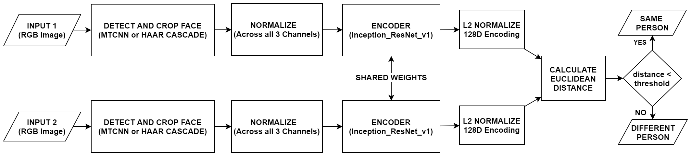
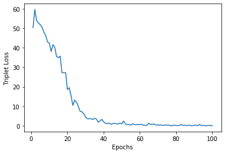
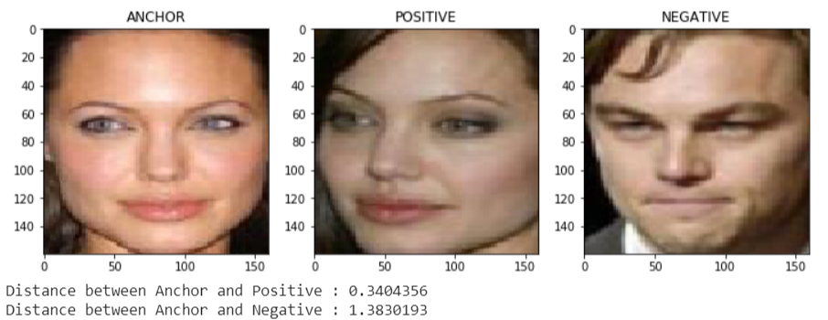
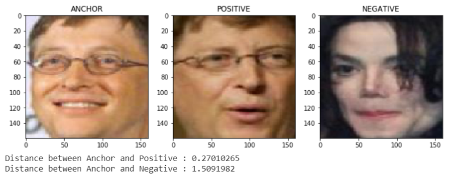

# Face Recognition using Siamese Network

This project aims to detect and recognize human faces in video streams. It can either be a video file or realtime feed from a webcam. MTCNN and Haar Cascades algorithms are utilized to detect and crop faces. Siamese Network is used to compare two faces and classify whether they are the same or not. Distance between face encodings generated by the Encoder network (Inception-ResNet-v1) is used as a metric to judge the simmilarity of two faces. The Encoder network is trained using the Triplet Loss, which requires efficient Triplet Mining.

Detailed description of this project along with results can be found [here](#project-description-and-results).

## Getting Started

### Prerequisites
Running this project on your local system requires the following packages to be installed :

* numpy
* matplotlib
* PIL
* mtcnn
* cv2
* keras
    
 They can be installed from the Python Package Index using pip as follows :
 
     pip install numpy
     pip install matplotlib
     pip install Pillow
     pip install mtcnn
     pip install opencv-python
     pip install Keras
     
     
 You can also use [Google Colab](https://colab.research.google.com/) in a Web Browser without needing to install the mentioned packages.
 
### Usage
This project is implemented as an interactive Jupyter Notebook. You just need to open the notebook on your local system or on [Google Colab](https://colab.research.google.com/) and execute the code cells in sequencial order. The function of each code cell is properly explained with the help of comments. 
  Before executing [Face_Recognition](Face_Recognition.ipynb) :
1. Create a folder named `Face_database` in the root directory.
2. Place images of known persons whom you want to recognize in this folder. 

Also before starting you need to make sure that the path to various files and folders in the notebook are updated according to your working environment. If you are using [Google Colab](https://colab.research.google.com/), then :
1. Mount Google Drive using : 

        from google.colab import drive
        drive.mount('/content/drive')
        
2. Update file/folder locations as `'/content/drive/path_to_file_or_folder'`.

## Tools Used
* [NumPy](https://numpy.org/) : Used for storing and manipulating high dimensional arrays.
* [Matplotlib](https://matplotlib.org/) : Used for plotting.
* [PIL](https://pillow.readthedocs.io/en/stable/) : Used for loading image files.
* [MTCNN](https://pillow.readthedocs.io/en/stable/) : Used for detecting and cropping faces.
* [OpenCV](https://opencv.org/) : Used for loading Haar Cascades and manipulating video streams.
* [Keras](https://keras.io/) : Used for designing and training the Encoder model.
* [Google Colab](https://colab.research.google.com/) : Used as the developement environment for executing high end computations on it's backend GPUs/TPUs and for editing Jupyter Notebook. 

## Contributing
You are welcome to contribute :

1. Fork it (https://github.com/rohanrao619/Face_Recognition_using_Siamese_Network/fork)
2. Create new branch : `git checkout -b new_feature`
3. Commit your changes : `git commit -am 'Added new_feature'`
4. Push to the branch : `git push origin new_feature`
5. Submit a pull request !

## License
This Project is licensed under the MIT License, see the [LICENSE](LICENSE) file for details.

## Project Description and Results
### Face Detection
[Multi-task Cascaded Convolutional Networks](https://kpzhang93.github.io/MTCNN_face_detection_alignment/) (MTCNN) is used for face detection during the training process as it provides an impressive accuracy. Haar Cascades is preffered during realtime applications as MTCNN is computationally slow. However this results in trading off a small amount of accuracy. 

### Encoder Network
Inception ResNet v1 is used as the Encoder network for generating face encodings in this project. It expects **160x160x3** RGB images with pixel values normalized accross all the 3 channels, to generate **128** dimensional face encodings. 

Detailed architecture of the Encoder network can be found [here](Models/Inception_ResNet_v1.png).

### Training the Encoder Network
Encoder network is trained using the following trainer model :

  

This trainer model is fed with a batch of Triplets. A Triplet is a set of 3 faces (Anchor, Positive and Negative). Anchor and Positive are faces of a same person, whereas Negative is a face of another person. This Trainer model tries to minimize the Triplet Loss (calculated using face encodings generated by the Encoder network for this batch).

### Triplet Loss
Triplet loss for a batch of Triplets is calculated as :

Here **m** denotes the no. of Triplets in the batch, **(anchor, positive and negative)** superscript **i** are face encodings (generated by the Encoder network) for the **i**th Triplet in the batch.  

**Alpha** is the least margin by which the two distances should be seperated. 

**distance** is the Euclidean distance between the two 128 dimensional encodings. Before calculating this distance, each encoding is **L2 Normalized**.

### Triplet Mining
There are 3 kind of Triplets :
* Easy Triplet : **distance(anchor,positive) + alpha < distance(anchor,negative)**
* Semi-hard Triplet : **distance(anchor,positive) < distance(anchor,negative) < distance(anchor,positive) + alpha**
* Hard Triplet : **distance(anchor,negative) < distance(anchor,positive)**

It can be seen that Easy triplets have loss=0 , making them useless for training the Encoder network. So mostly Hard and Semi-hard Triplets are desired for training the Encoder network. Triplet Mining is therefore required to find triplets having maximum impact on the training process.

### Siamese Network

As shown, two faces are compared to find if they belong to the same person or not. A given input face is checked against all the faces present in the Face_database (faces of known persons). Person having minimum distance to the input face is identified as the target (if distance < threshold). Threshold value needs to be tuned according to the application.

### Results 
For illustration, Encoder network was trained using triplets generated from a small subset of [Labelled Faces in the Wild](https://www.kaggle.com/jessicali9530/lfw-dataset) (LFW) dataset. It consists of 200 images of 20 celebrities (10 images per person). You can see this dataset [here](LFW_dataset/). 

Batches of size 100 with 75 hard and 25 random triplets (to respect the dataset distribution) were drawn. A Margin of 0.5 was used. The model was trained for 100 epochs using the Adam Optimizer with a learning rate of 0.0005, producing the following result :

The trained Encoder network was able to produce descent results considering the fact that it was trained on such small dataset. Few Triplets with their positive and negative distances (Calculated using the trained Encoder network) : 

 

 

### Webcam Demo
As you may have guessed by now, training an Encoder network requires a huge dataset and a lot of computational power. It is obviously not possible on our local machines. So I used pretrained weights for the Inception ResNet v1 Encoder network provided by [David Sandberg](https://github.com/davidsandberg/facenet) during realtime face recognition on video streams.  

 
 
As it can be seen, our Face Recognizer Model is pretty good in detecting multiple faces and recognizing them. But it recognizes only me and not Dr. Andrew Ng. Why? because he is not in the Face_database ! 

## Final Notes
**Thanks for going through this Repository! Have a nice day.** 
 **S Rohan Rao**  
Contact me : rohanrao619@gmail.com
